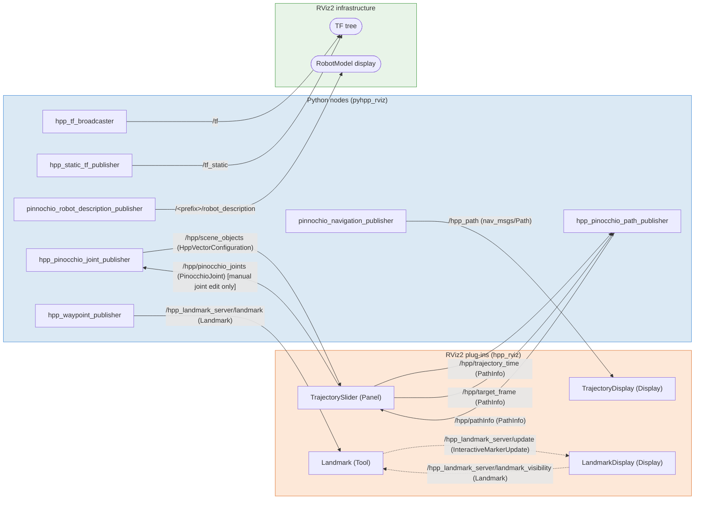

# RViz2 Viewer

## Overview

The RViz2 viewer backend replaces the legacy Gepetto viewer with a ROS 2 / RViz2-based visualization stack. It is split into two layers:

- A **Python layer** (`pyhpp_rviz`) that bridges HPP / Pinocchio with ROS 2. It publishes robot state, path and landmark information and reacts to commands coming from RViz2.
- A **C++ layer** (`hpp_rviz`) that provides native RViz2 plug-ins (panel, displays, tools) compiled against `rviz_common`.

## Python layer – `pyhpp_rviz`

The entry point is `pyhpp_rviz.viewer.RVizVisualizer`, a `pinocchio.visualize.BaseVisualizer` subclass. Typical usage:

```python
from pyhpp_rviz import RVizVisualizer
v = RVizVisualizer()
v.initViewer(robot)   # starts ROS 2 nodes and publishes URDF
v.display(q)          # sends TF transforms for configuration q
v.loadPath(path)      # publishes path metadata to TrajectorySlider
v.displayPath(path, target_frame="world/ee_link")  # publishes nav_msgs/Path for 3D preview
v.addLandMark([x, y, z], [qx, qy, qz, qw], "my_landmark")  # creates a landmark
```

On `initViewer` the following ROS 2 nodes are created:

- `hpp_pinocchio_joint_publisher` – publishes joint states (`/hpp/scene_objects`) and subscribes to joint commands from the TrajectorySlider panel (`/hpp/pinocchio_joints`).
- `hpp_pinocchio_path_publisher` – publishes path metadata (`/hpp/pathInfo`) and subscribes to time/frame commands from the TrajectorySlider panel.
- `hpp_waypoint_publisher` – publishes `Landmark` pose requests to the Landmark tool (`/hpp_landmark_server/landmark`).
- `pinnochio_robot_description_publisher` – publishes URDF on `/<prefix>/robot_description` with `TRANSIENT_LOCAL` QoS (latched) for each robot in the scene.
- `hpp_static_tf_publisher` – broadcasts static TF transforms for root joints (published once per unique frame pair).
- `pinnochio_navigation_publisher` – publishes `nav_msgs/Path` messages for path preview. The topic name is configurable (default `/hpp_path`).
- `hpp_tf_broadcaster` – streams per-frame TF transforms at display time via a `TransformBroadcaster` on `/tf`.

## Python API reference

### `initViewer` / `display`

```python
v.initViewer(robot)   # initialise model, ROS nodes, publishes URDF and static TF
v.display(q)          # forward kinematics + broadcast /tf for every frame
v(q)                  # alias for display(q)
```

### Path display

```python
v.loadPath(path)
# Stores the path and publishes PathInfo (length + frame list) on /hpp/pathInfo.
# Required before the TrajectorySlider can scrub the trajectory.
# Does NOT publish the 3D geometry.

v.displayPath(path, dt=0.05, topic_name="hpp_path",
              origin="world", target_frame=None)
# Samples the path at interval dt, computes FK at each sample, and
# publishes a nav_msgs/Path on <topic_name> for 3D preview in RViz2.
# target_frame must be a valid Pinocchio frame name; if None or "",
# nothing is published.
```

### Landmarks

```python
v.addLandMark(xyz, quat_xyzw, name=None)
# Publishes a Landmark message on /hpp_landmark_server/landmark.
# xyz        : [x, y, z] position in the fixed frame ("world").
# quat_xyzw  : [qx, qy, qz, qw] orientation.
# name       : optional string identifier; defaults to "" if None.

v.addLandMarkFromFrame(target_frame, name)
# Looks up target_frame in the current Pinocchio model, reads its
# pose from the last display() call, and calls addLandMark().
```

### Constraint graph viewer

An optional integration with `pyhpp_plot.GraphViewerThread` provides an interactive constraint-graph viewer served as a React web app.

```python
v.setGraph(graph)       # set the constraint graph (PyWGraph)
v.setProblem(problem)   # set the planning problem (PyWProblem)
v.launch_graph_viewer() # start the GraphViewerThread (graph + problem required)
```

When a configuration is generated from the graph viewer it is forwarded to `display()` automatically.

## ROS 2 communication graph

The diagram below shows every topic exchanged between the Python visualizer, the helper publisher nodes, and the RViz2 plug-ins. Arrows point from publisher to subscriber; message types are shown in italics. Red arrows are commands sent from an RViz2 plug-in back to Python; dashed grey arrows are intra-RViz2 exchanges.



**Legend**

| Style | Meaning |
|---|---|
| Solid black arrow | publisher → subscriber |
| Red label *(rendered as plain arrow above, see topic reference for direction)* | panel command (RViz2 → Python) |
| Dashed grey arrow | optional, intra-RViz2 exchange |
| Blue box | Python node |
| Orange box | RViz2 plug-in |
| Green ellipse | RViz2 infrastructure |

## Topic reference

| Topic | Direction | Message type | Description |
|-------|-----------|--------------|-------------|
| `/hpp/pathInfo` | Python → Panel | `PathInfo` | Announces a new path (total length in seconds, available frame names). |
| `/hpp/trajectory_time` | Panel → Python | `PathInfo` | Current slider time (field `current_time`, in seconds) sent during playback. |
| `/hpp/target_frame` | Panel → Python | `PathInfo` | Selected target TF frame (field `target_frame`) for path 3D preview. |
| `/hpp/pinocchio_joints` | Panel → Python | `PinocchioJoint` | Published when the user manually edits a joint slider in the panel (not during trajectory playback). |
| `/hpp/scene_objects` | Python → Panel | `HppVectorConfiguration` | Full configuration vector with per-joint details, used to populate the joint tree and the configuration text field. |
| `/hpp_landmark_server/landmark` | Python → Tool | `Landmark` | Requests creation of a new interactive landmark at the given pose. |
| `/hpp_landmark_server/landmark_visibility` | Display → Tool | `Landmark` | Published by LandmarkDisplay when a landmark's visibility toggle is changed; the Landmark tool applies the change on its InteractiveMarkerServer. |
| `/hpp_landmark_server/update` | Tool → Display | `visualization_msgs/InteractiveMarkerUpdate` | Published by the InteractiveMarkerServer (hosted in the Landmark tool) when markers are inserted or updated; consumed by LandmarkDisplay to populate the property panel. |
| `/tf` | Python → RViz2 | `tf2_msgs/TFMessage` | Per-frame dynamic TF transforms, broadcast on every `display()` call. |
| `/tf_static` | Python → RViz2 | `tf2_msgs/TFMessage` | Root-joint static transforms, broadcast once on `initViewer()` (deduplicated per frame pair). |
| `/<prefix>/robot_description` | Python → RViz2 | `std_msgs/String` | URDF string published with `TRANSIENT_LOCAL` QoS, consumed by the RViz2 RobotModel display. |
| `/hpp_path` | Python → TrajectoryDisplay | `nav_msgs/Path` | Path geometry for 3D preview in RViz2, published by `displayPath()`. |

## Custom message types

All custom messages are defined in `msg/` and belong to the `hpp_rviz` ROS 2 package.

### PathInfo

Carries timing and frame information for trajectory playback.

```
std_msgs/Header header
float64 path_length      # total duration of the path (seconds)
float64 current_time     # current playback position (seconds)
string[] frame_names     # available Pinocchio frame names for target selection
string target_frame      # currently selected TF target frame
```

### PinocchioJoint

Carries the current value of one Pinocchio joint.

```
std_msgs/Header header
string name              # joint name as in the Pinocchio model
string type              # joint type: "JOINT" (nq=1) or "FREE_FLYER" (nq=7)
float64[] values         # joint coordinates (1 value for JOINT, 7 for FREE_FLYER)
float64 min              # lower position bound (single-dof joints)
float64 max              # upper position bound (single-dof joints)
```

### HppVectorConfiguration

A full robot configuration packaged for scene-object display in the panel.

```
float64[] hpp_vector     # flat configuration vector (HPP ordering)
PinocchioJoint[] joints  # per-joint details for tree population
```

### Landmark

Pose and visibility information for a named landmark. Used both to request landmark creation from Python (`/hpp_landmark_server/landmark`) and to toggle visibility from the display (`/hpp_landmark_server/landmark_visibility`).

```
std_msgs/Header header
bool enable              # true = show, false = hide
string name               # landmark identifier
float64 tx               # translation x (metres)
float64 ty               # translation y (metres)
float64 tz               # translation z (metres)
float64 ow               # orientation quaternion w
float64 ox               # orientation quaternion x
float64 oy               # orientation quaternion y
float64 oz               # orientation quaternion z
```

## RViz2 plug-ins

### TrajectorySlider panel

Registered as `hpp/TrajectorySlider`. The panel provides:

- A time slider and spin-box to scrub through the current path.
- Play / pause button with configurable speed multiplier.
- A TF target-frame selector (combo-box populated from `PathInfo.frame_names`).
- A joint-value tree that reflects the current configuration and allows interactive editing of individual joints (JOINT and FREE_FLYER types). Free-flyer quaternion components are automatically renormalised on edit.
- A read-only text field showing the current HPP configuration vector, with a one-click copy button.

### TrajectoryDisplay

Registered as `hpp/TrajectoryDisplay`. Inherits `rviz_default_plugins::displays::PathDisplay` and automatically creates a `TrajectorySlider` panel (pane title: *"HPP Trajectory Control"*) on initialization. Its path topic is fixed to `/hpp_path`.

### LandmarkDisplay

Registered as `hpp/LandmarkDisplay`. Inherits `InteractiveMarkerDisplay` and connects to the `/hpp_landmark_server` interactive marker server. Each landmark discovered via `/hpp_landmark_server/update` gets a `LandmarkProperty` entry in the RViz2 property panel, exposing (read-only) position, orientation and a visibility toggle. Toggling visibility publishes a `Landmark` message on `/hpp_landmark_server/landmark_visibility`; the Landmark tool subscribes to that topic and resizes the interactive marker accordingly (scale 0.001 to hide, nominal scale to show).

### Landmark tool

Registered as `hpp/Landmark`. A left-click in the 3D viewport ray-casts against the scene and creates a new `InteractiveLandmark` at the picked position with a default identity orientation. The interactive marker supports 6-DOF manipulation (three move axes and three rotate axes, all in `FIXED` orientation mode). The tool also listens on `/hpp_landmark_server/landmark` so that landmarks can be created programmatically from Python via `addLandMark()` or `addLandMarkFromFrame()`. A right-click context menu on each marker offers *Edit* (opens a pose dialog with spin-boxes) and *Delete*.